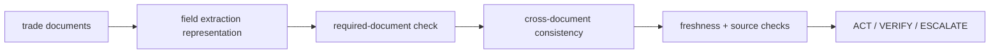

# Architecture

## Document objects
Represent document kind, normalized fields, source group, issue date, and authorization expiry.

## Consistency layer
Checks shared shipment identifiers, consignee identity, and gross-weight agreement.

## Evidence completeness
Verifies required document kinds are present.

## Decision gate
Escalates conflicts/staleness, verifies incomplete/correlated evidence, and acts only on clean synthetic cases.

## Design principle

Never let extraction success silently substitute for evidence consistency.
